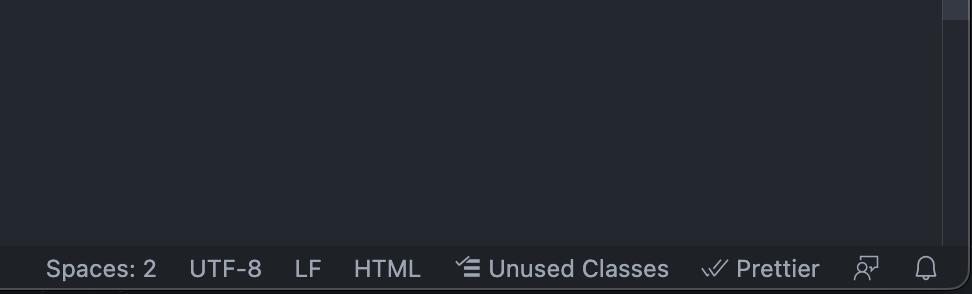
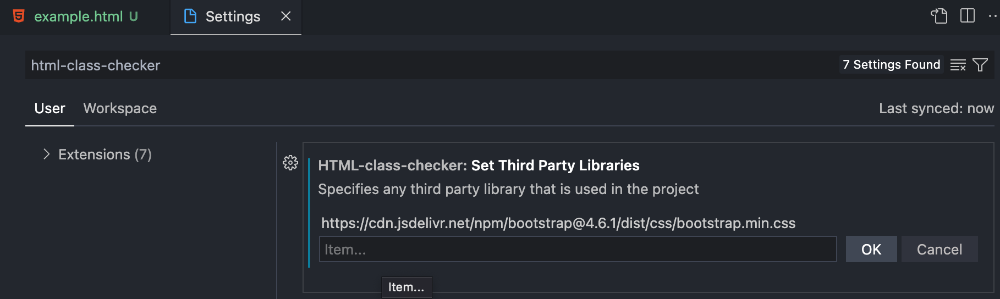
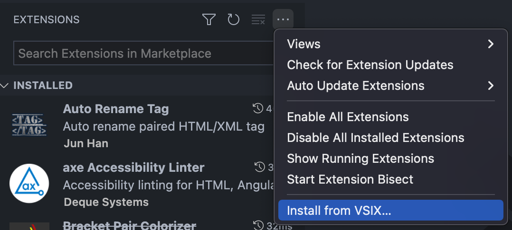

# HTML Class Checker

Check which of the HTML classes you have in your file are not being used anywhere else, so you can safely remove them.

## Features

* **Class Highlighting**: Highlight any HTML classes that are not being used anywhere else in your project.
* **Class Removal**: Delete any unused classes in you HTML based on context.
* **CDN Libraries**: Add any third party vendors or files to check with the classes (i.e. Bootstrap) in case they don't reside on the actual codebase.

## Commands

Currently, these are the commands available:

* `HTML-CC: Add third party files in settings`: This command will open the settings file of VS Code, in the section that the third party URLs should be added.
* `HTML-CC: Reload third party files`: Whenever this command is ran, all the URLs in the settings file will be loaded into memory.
* `HTML-CC: Highlight unused classes in HTML file`: This is the main command, where you can select and remove each of unused classes found in your file. Here you can pick which up to which of the parent directories to check it to.

## Extension Settings

This extension contributes the following settings:

* `html-class-checker.setThirdPartyLibraries`: A list of string <u>**URLs**</u> contaning external files you want to add to check with. These files will load into memory whenever the Extension is loaded for the first time or when you add a new file into the list.

## How it works

### General Use

This extension will tell you the amount of unused classes found, as well as select each one of them in the editor, so you can remove them manually or just check them to see if any of them should be removed.

The way it works is like this:

1. You run the `HTML-CC: Highlight unused classes in HTML file` command in the _Command Palette_ (Cmd+Shift+P or Ctrl+Shift+P)
2. A small selection window appears, where you pick the parent directory level you want it to search for matching classes.
3. The Extension will look for all classes in the HTML that aren't used in any `.css`, `.scss`, `.js` or `.ts` files.
4. A small information window appears on the bottom left, telling you the amount of unused classes found (if any).
5. If there's any classes found, you can look them one by one by clicking the `See Classes` button.
6. From there, the extension will each class in the list and give you an option to either `Remove` it or go to the `Next` class.
7. After you go through all the classes, the information window closes.

***

You can also execute the command by pressing the `Unused Classes` button in the bottom right of your status bar.

When running the command by using the button, you might notice that it won't ask you for the parent directory level,unless you run it for the first time and there's no `default` saved. If you wish to change the default directory, run the command through the _Command Palette_, which will always show you the parent directory level selector.

### Adding CDN Libraries

If you want to add a new CDN third party, you can do it by following these steps:

1. Open the _Command Palette_ (Cmd+Shift+P or Ctrl+Shift+P)
2. Look for the command `HTML-CC: Add third party files in settings`
3. This will open the settings file, where you can input the URL of the file to load
4. the Extension will automatically reload all CDNs to make sure they're cached

### How to manually install it

At the time this readme was written, the Extension has not been published to the Extension Marketplace, so we have to install it manually. Thankfully the way to do it is very simple.

1. Download the `.vsix` file in the repo.
2. Go to the Extensions tab in the sidebar.
3. Click on the 3 dots (...) at the top right of the sidebar.
4. Click the `Install from VSIX...` option.
5. Look for the `.vsix` file.

## Known Issues

1. Having multiple "root" directories in your workspace doesn't save your default directory pick depending on the "root" the file to check is in.
2. There's no way to remove all the classes without having to look at them one by one, will probably be added on a later version.
3. SCSS files are not completely compatible since the Extension just matches the whole class inside the text of the data, so if there's a nested class like `.block { &__section { ... } }` the tool won't find it as it doesn't match the literal string.
   * For now a workaround is compiling the `SCSS` to a dist folder and using the extension with the compiled CSS.
4. The same is true  with any `JS` classes that are built dynamically and sadly, for now there's no workaround for that.
